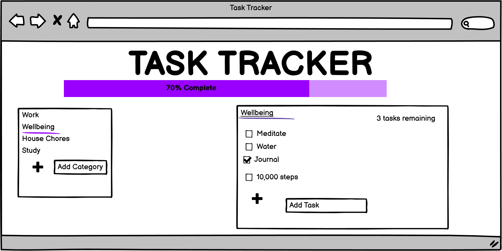
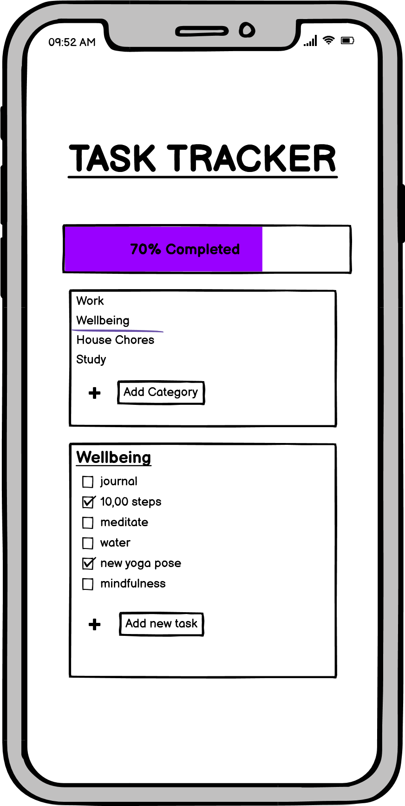

# MileStone Project Two
## Task Tracker

In today's world there are ususally a million and one things going on in a given day. It's sometimes difficult to keep track 
of all the tasks and errands that need to be completed, resulting in somethings not getting done or forgotten. Having one 
place to check for reference, track and store these daily tasks is an extremely helpful resource. 

This project is a simple and responsive design which is super user friendly. It allows the user to break down their daily tasks into sections or categories of their choice, for example, work, study or exercise. Within in these categories their tasks are broken down and automatically tracked once a task is completed and displayed conveniently in a progress bar. 

## Ux
### Strategy

The basic strategy behind this application was to build a simple and easy to navigate site where all the daily tasks are stored in one place. It’s broken down into different categories to allow the user to amend to different lists and segregate tasks so all the tasks within one list are relevant to one another. It allows for better organisation of daily tasks.
The objectives behind building the site were to create a single place where users could come to track and organise their daily tasks and habits.

**User Stories**

As a user of this application: 

* I would like one place to track and store daily tasks.
* An ability to view sub categories and broken down tasks within these categories.
* Ability to add and remove tasks.
* Ability to check off when complete.
* Monitoring of the progression of completed tasks.
* Simplifies big tasks into smaller actions that compound over time. 
* Creates a visual cue with a progression bar that encourages you to act.
* Satisfying to record progress and check off tasks throughout the day. 
* Easy to use on desktop and mobile.
* Simple design with no complicated format. 

### Scope
The specifications and requirements for the site to adhere to the user stories include:
* A form to easily create new task categories
* A form to easily add new tasks to associated category
* A checkbox to check and uncheck completed tasks
* A button to clear completed tasks
* A button to clear a category
* A responsive counter to display tasks remaining
* A progress bar to display progression of tasks completed

### Structure
To ensure not to overload the user with all the tasks at once, the corresponding tasks linked to the category are displayed responsively. Once the user clicks on a category the corresponding task list changes.  This interaction design makes it very easy for the user to navigate through their category lists and corresponding task lists. 
All the data is stored in local storage so when the user goes back to the page the completed and uncompleted tasks are still there along with the categories they fall under.

### Skeleton
The structure of the site was designed in such a way that everything should be visible on the one page. There is no need to navigate away from the page and all the information is visible all together. The categories list is arranged on the left hand side in a smaller box and when clicked the corresponding task box appears on the right in a larger box. This is to accommodate left to right design and also as there typically would be more tasks than categories, the bigger task box allows for the larger task list to be seen clearer. 
The structure mock ups were roughly done on [Balsamiq WireFrames](https://balsamiq.com/) . 

### Surface
The surface of the site should be clean and simple. As the content is all on one page it should not be overloaded with graphics and animations. Easy to follow and neutral colours as bright colours can come across alarming especially if there are many tasks appearing on the screen. 

## Features
### Existing Features
* Easy, simple design to allow for seamless navigation.
* Task category section to break tasks down into separate headings.
* Ability to customize category section into headings of your own choice with as many categories as you need.
* Categories can be deleted using the delete category button and added using the “add new category “text box.
* When a particular category is selected, the selected category is highlighted and the corresponding task list is shown on the right hand side of the desktop or below on a smaller device.
* The task list can also be modified as the user likes by adding and checking off completed tasks as they go. 
* There is a clear completed task button below the task list so the user can clear them out of the list as they go. 
* On the right had corner of the task list there is also a task counter. This also changes responsively to the amount of tasks still remaining to be completed within the category. 
* There is also a responsive progress bar that correlates with the amount of tasks remaining within the selected category to give the user a visual cue of how many tasks have been completed. 
* The categories, tasks, checked and unchecked tasks are stored in local storage so when the user reloads the page their tasks are still there.

### Features Left to Implement

* Adding a calender feature API to link with google calander so appointments automatically link to tasks. 
* Along with the calender, tasks could then be integrated with a time stamp so  the day could be better planned out i.e tasks could have an added time frame to have task completed by.
* For a mobile app, reminder notifications could also be installed to pop up if tasks were due to be completed at a certain time.
* An ability to add links to other apps. For example, if 10,000 steps was a task to be completed, there would be an option to link your FitBit account to allow for seamless and automatic task completion without having to manually check it off. 
## Technologies Used

1. CSS programming language
2. HTML programming language
3. Javascript Programming language.
4. [BootStrap](https://getbootstrap.com/)
* To create a responsive structure for the website. 
5. [Balsamiq wireframes](https://balsamiq.com/wireframes/)
* used to create mock ups of what the site will look like
6. [Google Font](https://fonts.google.com/)
* Was used to style the fonts used in the website
7. [Gitpod](https://gitpod.io/workspaces/)
* To build and develop code
8. [w3schools](w3schools.com)
* To help with formatting and styles.
9. [Stackoverflow](https://stackoverflow.com/)
* The forums were useful for styling issues.
10. [HTML Formater](https://www.freeformatter.com/html-formatter.html#ad-output)
* To beatify HTML code
11. [W3C validator Service](https://validator.w3.org/#validate_by_input)
* To validate HTML code
12. [W3C CSS validator service](https://jigsaw.w3.org/css-validator/validator)
* To validate CSS code
13. [Youtube](https://youtube.com)
* To help with ideals and specific script issues.

## Testing

The HTML was checked using the [W3C validator Service](https://validator.w3.org/#validate_by_input).

The CSS was checked using the [W3C CSS validator service](https://jigsaw.w3.org/css-validator/validator).

Manual testing was carried out to ensure the site carries out the intentions of the user stories.
On opening the page the category list is clear and visible and when a new category is typed into the form box a new category is created. Multiple categories can be created by continually adding to list.

A pointer cursor is evident when mouse hovers over categories prompting the user that they are clickable. Also the opacity lowers to highlight the category being hovered over to again prompt the item to be clicked.

The opacity also lowers when the user attempts to type in the new category form box to encourage the user to add a category.

When a category is selected the category font weight increases and stays in this highlighted state to signal to the user that this is the category selected.

When category is selected the corresponding task list appears. User is able to add to task list with form button as many times as they like.

User is also prompted to enter new tasks as opacity lowers again and the underline transitions.

When a task is completed it can be checked off and line goes through task item.

The task counter responds correctly to remaining tasks and the word task changes to plural tasks when a value of more than one is in the count. 

The progress bar responds correctly to remaining tasks.

The title of the task list changes to correspond with category selected.

The tasks can be unchecked by re-clicking the tasks.

The clear complete buttons clear any checked tasks.

The delete category button clears the highlighted category.

When page is refreshed all the information has been stored on local storage and is still available.

The project was also tested on multiple browsers (Chrome, Microsoft edge, Internet Explorer, and Firefox) and device sizes to ensure compatibility and responsiveness.

#### Bugs
* The progress bar updates when the selected category is highlighted and works when tasks are checked and unchecked but when a new category is selected it doesnt auto update along with the task count. Once a task is checked or unchecked it updates, but not automatically.

## Deployment

A repository was created on GitHub and Gitpod was used to write the code. The code was commited and pushed to Github regularly to ensure it was saved. The GitHub repository was then deployed to GitHub pages by:

1. Logging into GitHub
2. Selecting repositories and then MileStoneProject2_TaskTracker.
3. Then select settings from the top menu bar.
4. Under GitHub pages
5. Under source, select master branch.
6. The website is now deployed and a link appears for the deployed site.
7. This link can now be cloned and run locally.

## Credits
### Content
The progress bar was modelled with the help of this [YouTube Video](https://www.youtube.com/watch?v=QxQRtwAtqKE) and significantly modified to fit the styling, sizing and progression of tasks.

### Media
#### Image
The source for the [Background Image](https://fancycrave.com/free-stock-video-websites/).

### Acknowledgements
I got inspiration for this project as I like to try and keep organised but tend to keep lists everywhere and don’t have them grouped into types and headings. Having one place to go for references and has all my tasks stored and broken down into smaller individually items is extremely handy. Also the progress bar is encouraging to get the list completed. 

Also my mentor, Brian Macharia for helping me along the way!
